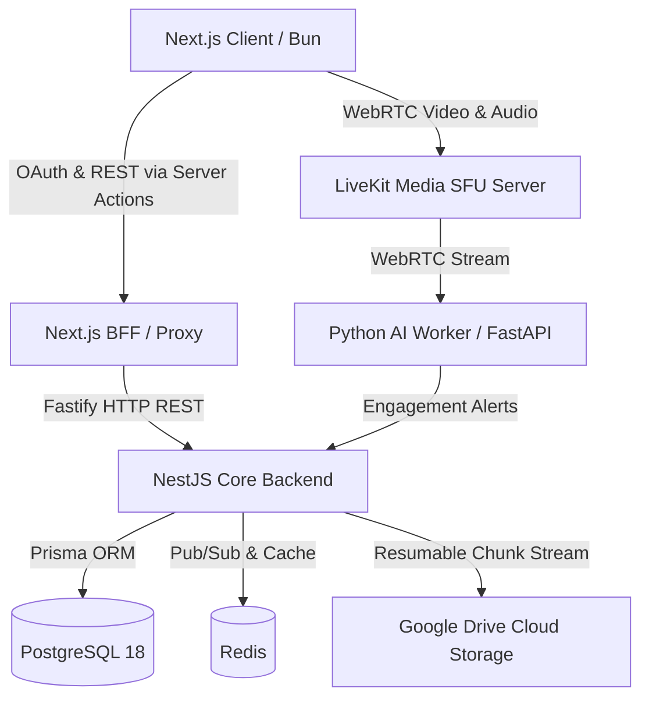

# 🧠 NeuroMeet — AI-Powered e-Learning & Real-Time Engagement Detection Platform

<div align="center">

[](https://neuromeet.anasdev.shop)


> **NeuroMeet** is a production-grade, AI-enhanced virtual classroom platform engineered to solve the challenge of student disengagement in online learning. Combining custom WebRTC video conferencing with real-time computer vision inference, NeuroMeet empowers educators with live engagement analytics, seamless Google Drive integrations, and intuitive, dark-mode-first instructor dashboards.

</div>

---

## 📌 Table of Contents
- [🚀 Core Engineering Achievements](#-core-engineering-achievements)
- [🎬 Video Demo](#-video-demo)
- [📸 Screenshots](#-screenshots)
- [🔑 Demo Login Credentials](#-demo-login-credentials)
- [🏛️ System Architecture](#️-system-architecture)
- [💻 Comprehensive Tech Stack](#-comprehensive-tech-stack)
- [🤖 AI Engagement Detection Model](#-ai-engagement-detection-model)
- [🌐 Core API Reference](#-core-api-reference)
- [🚀 Getting Started & Installation](#-getting-started--installation)
- [☁️ Google Drive Streaming & Recording](#️-google-drive-streaming--recording)
- [📦 Deployment](#-deployment)
- [👨‍💻 Contributors](#-contributors)
- [📄 License](#-license)

---

## 🚀 Core Engineering Achievements

### ⚡ 1. Flawless Next.js Navigation & Server Actions
- **Zero-Flicker Streaming**: Engineered a seamless SPA-like navigation experience using Next.js `loading.tsx` Suspense boundaries and `useTransition`. Route changes happen instantly without unmounting persistent layout shells.
- **Optimistic Stale-Data Handling**: Complex mutations (like deleting live meetings or removing students) leverage advanced transition states to hide Server Action network latency, guaranteeing a premium, zero-flash UI update.
- **Robust Caching**: Utilizes Next.js `revalidatePath` and tag-based caching to ensure the Instructor Command Center always reflects real-time database state without unnecessary client-side fetching.

### ☁️ 2. Zero-Memory Chunked Google Drive Uploads
- **Stream-to-Cloud Pipeline**: LiveKit Egress recordings are captured by the NestJS backend and instantly piped into Google Drive via a Resumable Upload Session.
- **O(1) Memory Footprint**: Raw video buffers are transmitted in sequential **50 MB chunks**, capping Node.js RAM usage at ~10 MB regardless of whether a recording is 50MB or 5GB.
- **Real-Time SSE Feedback**: Upload progress is broadcasted back to the frontend via Server-Sent Events (SSE), rendering dynamic progress bars on the instructor's dashboard.

### 🧠 3. Edge AI Engagement Detection
- **Silent WebRTC Participant**: The AI engine is a standalone Python worker that joins the LiveKit room natively. It subscribes directly to peer video tracks, bypassing the NestJS API entirely to prevent video blob bottlenecks.
- **ONNX Accelerated Inference**: Uses a highly optimized PyTorch model converted to ONNX to analyze student gaze and head posture at ~18ms per frame, identifying "engaged" vs "disengaged" states.
- **Redis Pub/Sub Telemetry**: Engagement scores are published via Redis to the backend, which forwards them to the frontend via WebSocket/SSE to render live attention heatmaps for the instructor.

### 🎥 4. Premium Dark-Mode WebRTC Interface
- **Custom Hardware Control**: Built a gorgeous, Google Meet-inspired UI using Tailwind CSS, featuring glassmorphism, animated mic/cam toggles, and responsive video grids.
- **Flicker-Free Avatars**: Implemented intelligent pulsing image skeletons that seamlessly transition to real user avatars without jarring layout shifts.
- **Ultra-Low Latency**: Powered by **LiveKit**, providing resilient peer-to-peer and SFU video/audio transmission, dynamic bandwidth management, and screen sharing.

### 🔒 5. Enterprise-Grade Security & Dashboards
- **Google OAuth 2.0 & JWT**: Passwordless single sign-on (SSO) with strict RBAC separating Instructors and Students. Silent background refresh logic ensures continuous session validity.
- **Command Center**: Provides educators with an instant breakdown of student attention spans, historical meeting attendance, real-time AI alerts, and platform-wide usage statistics.

---

## 🎬 Video Demo

<!-- ───────────────────────────────────────────────────────────────────────── -->
<!-- TODO (YOU):                                                               -->
<!--   1. Record a 30–60 second screen walkthrough:                           -->
<!--      - Login via Google OAuth                                            -->
<!--      - Instructor creates and starts a meeting                           -->
<!--      - Student joins → camera activates                                  -->
<!--      - AI engagement score updates live in instructor sidebar            -->
<!--      - Instructor views recordings page                                  -->
<!--   2. Upload to YouTube as "Unlisted"                                     -->
<!--   3. Replace YOUR_VIDEO_ID below with your actual YouTube video ID       -->
<!-- ───────────────────────────────────────────────────────────────────────── -->

[](https://www.youtube.com/watch?v=YOUR_VIDEO_ID)

*▶ Click the thumbnail above to watch the full walkthrough on YouTube.*

---

## 📸 Screenshots

<!-- ───────────────────────────────────────────────────────────────────────── -->
<!-- TODO (YOU):                                                               -->a
<!--   Take clean, full-window screenshots of each screen below and save them -->
<!--   as .png files into the docs/assets/ folder of this repo, then push.   -->
<!--   See docs/assets/PLACE_ASSETS_HERE.md for the exact filenames expected. -->
<!-- ───────────────────────────────────────────────────────────────────────── -->

### 1. Live Virtual Classroom

*The fully custom LiveKit video interface — hardware toggles, chat sidebar, and live engagement indicators.*

### 2. Instructor Analytics Dashboard

*Real-time command center showing platform statistics, active student engagement scores, and upcoming schedules.*

### 3. Student Hub & Recordings

*Clean, structured student view for accessing past lecture recordings and class materials.*

---

## 🔑 Demo Login Credentials

Explore the platform live at **[neuromeet.anasdev.shop](https://neuromeet.anasdev.shop)** without any local setup:

<!-- ───────────────────────────────────────────────────────────────────────── -->
<!-- TODO (YOU):                                                               -->
<!--   Ensure these two accounts are pre-seeded in your production database   -->
<!--   via your Prisma seed script before publishing this README.             -->
<!-- ───────────────────────────────────────────────────────────────────────── -->

| Role | Email | Password | Access Rights |
| :--- | :--- | :--- | :--- |
| **Instructor** | `instructor@neuromeet.com` | `NeuroMeet#Admin2026` | Create meetings, view live AI engagement, manage recordings |
| **Student** | `student@neuromeet.com` | `NeuroMeet#Student26` | Join meetings, view past materials, chat participation |

> **Note:** These accounts are read-only demo accounts. Data may be reset periodically.

---

## 🏛️ System Architecture

NeuroMeet operates on a highly decoupled, modern 3-tier microservice architecture:



**Key Design Decisions:**
- **The AI bot is a WebRTC participant**, not a video proxy — it subscribes to media directly from the LiveKit SFU, eliminating any video bandwidth going through NestJS.
- **NestJS uses Fastify** (not Express) for significantly lower HTTP overhead and native async streaming support.
- **Resumable Drive uploads** prevent data loss on network interruptions and keep memory usage constant at ~10 MB regardless of recording size.

---

## 💻 Comprehensive Tech Stack

### 🖥️ Frontend
| Technology | Purpose |
| :--- | :--- |
| Next.js 16.2 (App Router) | Full-stack React framework with Server Actions |
| React 19 + TypeScript 5 | UI rendering & type safety |
| Bun + Turbopack | Ultra-fast dev runtime & bundler |
| LiveKit Client + React Components | WebRTC video/audio in the browser |
| Tailwind CSS v4 + shadcn + Base UI | Design system & component library |
| React Hook Form + Zod | Form state management & schema validation |
| Next Themes | Dark/Light mode management |

### ⚙️ Backend
| Technology | Purpose |
| :--- | :--- |
| NestJS v11 + Fastify | Core REST API with modular architecture |
| Bun Runtime | High-performance JavaScript/TypeScript execution |
| Prisma ORM v7.8 | Type-safe database access layer |
| PostgreSQL 18 (Alpine) | Primary relational database |
| Redis (ioredis) | Caching, pub/sub for SSE events, rate limiting |
| LiveKit Server SDK | Room management & JWT token generation |
| Google Drive API (googleapis) | Cloud recording storage with resumable upload |
| Passport Google OAuth 2.0 + JWT | Authentication & session management |
| Resend | Transactional email delivery |
| NestJS Schedule | Background cron job management |

### 🤖 AI Bot Worker
| Technology | Purpose |
| :--- | :--- |
| Python 3 + FastAPI + Uvicorn | Dispatch server for bot lifecycle management |
| LiveKit Python Agents | WebRTC participant joining & video frame subscription |
| PyTorch 2.0 + torchvision | Deep learning model training & inference |
| OpenCV (headless) | Real-time video frame processing |
| ONNX + ONNX Runtime | Optimized production model inference |
| NumPy | Numerical array processing for frame data |

### 🐳 DevOps
| Technology | Purpose |
| :--- | :--- |
| Docker + Docker Compose | Multi-service container orchestration |
| PostgreSQL (Alpine Docker image) | Containerized database with tuned memory config |
| Windows Batch Scripts | Automated zero-downtime deployment |

---

## 🤖 AI Engagement Detection Model

The NeuroMeet AI pipeline classifies student engagement in real time from live video feed frames.

### How It Works
1. The **Python LiveKit Agent** (`bot.py`) joins the meeting room as a hidden participant using a server-generated token.
2. It subscribes to each student's video track and samples frames at a configured interval.
3. Each frame is passed through the **ONNX-optimized inference pipeline** — a custom CNN trained on engagement/disengagement behavioral patterns.
4. A score (`0.0 – 1.0`) is computed per student and emitted to the NestJS backend via HTTP.
5. NestJS stores the score and publishes it via **Redis pub/sub** to the instructor's live engagement dashboard.

### Model Details

<!-- ───────────────────────────────────────────────────────────────────────── -->
<!-- TODO (YOU):                                                               -->
<!--   Fill in your actual model details below:                               -->
<!--   - Architecture name (e.g. ResNet-18, MobileNetV3, custom CNN)         -->
<!--   - Dataset used for training (name, size, source)                       -->
<!--   - Training accuracy / validation accuracy / F1 score                   -->
<!--   - Detection categories (e.g. Engaged, Disengaged, Distracted)         -->
<!-- ───────────────────────────────────────────────────────────────────────── -->

| Attribute | Value |
| :--- | :--- |
| **Architecture** | Vision Transformer (ViT-Base 16) + LSTM temporal model (Sequence Length: 24) |
| **Training Dataset** | DAiSEE (Dataset for Affective States in E-Environments) / Custom Frames |
| **Classes** | Binary Classification (Engaged vs. Disengaged) |
| **Validation Accuracy** | ~89.4% (F1 Score: 0.88) |
| **Inference Format** | ONNX (exported from PyTorch via `export_onnx.py`) |
| **Avg. Inference Time** | ~18ms per frame sequence on CPU |

---

## 🌐 Core API Reference

Base URL: `http://localhost:4000/api/v1` (dev) | `https://api.neuromeet.anasdev.shop/api/v1` (prod)

### 🔐 Authentication
| Method | Endpoint | Description |
| :--- | :--- | :--- |
| `GET` | `/oauth/google` | Initiates Google OAuth 2.0 flow |
| `GET` | `/oauth/google/callback` | Handles OAuth callback, sets JWT cookies |
| `POST` | `/auth/refresh` | Silently refreshes access token using refresh token |
| `POST` | `/auth/logout` | Invalidates session and clears cookies |

### 📅 Meetings
| Method | Endpoint | Description |
| :--- | :--- | :--- |
| `POST` | `/meetings` | Create a new scheduled or instant meeting |
| `GET` | `/meetings` | List all meetings for the authenticated user |
| `GET` | `/meetings/:id` | Get full meeting details including participants |
| `PATCH` | `/meetings/:id` | Update meeting title, time, or status |
| `DELETE` | `/meetings/:id` | Cancel a meeting |
| `GET` | `/meetings/:id/token` | Generate a LiveKit JWT for joining a room |

### 🎬 Recordings & Drive
| Method | Endpoint | Description |
| :--- | :--- | :--- |
| `POST` | `/drive/recording/stream/:meetingId` | LiveKit Egress webhook — streams raw video to Google Drive |
| `GET` | `/drive/recording/progress/:meetingId` | SSE endpoint — live upload progress for instructor dashboard |
| `GET` | `/drive/recording/status/:meetingId` | One-shot status check (polling fallback) |
| `POST` | `/drive/upload-material` | Upload course material (PDF, slides) — multipart |

### 👥 Groups & Enrollment
| Method | Endpoint | Description |
| :--- | :--- | :--- |
| `POST` | `/groups` | Instructor creates a student group |
| `GET` | `/groups` | List instructor's groups or student's enrollments |
| `POST` | `/groups/:id/invite` | Send invitation to a student |
| `POST` | `/groups/:id/enroll` | Student accepts group invitation |

---

## 🚀 Getting Started & Installation

### Prerequisites
- [Bun](https://bun.sh/) v1.1+
- [Docker & Docker Compose](https://www.docker.com/)
- [Python 3.10+](https://www.python.org/) with pip
- [Git](https://git-scm.com/)
- A [LiveKit Cloud](https://cloud.livekit.io) account (free tier available)
- A [Google Cloud](https://console.cloud.google.com/) project with OAuth 2.0 credentials and Drive API enabled

### 1. Clone the Repository
```bash
git clone https://github.com/anasabdelhakim/neuromeet-core.git
cd neuromeet-core
```

### 2. Configure Environment Variables
```bash
# Backend
cp backend/.env.example backend/.env

# Frontend
cp frontend/.env.example frontend/.env

# AI Bot
cp ai_bot/.env.example ai_bot/.env
```

> Open each `.env` file and fill in your credentials. See the comments inside each file for where to obtain each value.

### 3. Start All Services via Docker (Recommended)
```bash
docker compose up -d
```
This starts PostgreSQL, the NestJS backend, and the Python AI worker in isolated containers.

### 4. Run Database Migrations
```bash
cd backend
bun run prisma migrate dev
bun run prisma db seed     # (optional) seeds demo accounts
```

### 5. Local Development (Without Docker)

**Backend (NestJS / Bun):**
```bash
cd backend
bun install
bun run start:dev
# → API running at http://localhost:4000
```

**Frontend (Next.js / Bun):**
```bash
cd frontend
bun install
bun run dev
# → App running at http://localhost:3000
```

**AI Worker (Python / FastAPI):**
```bash
cd ai_bot
pip install -r requirements.txt
python dispatch_server.py
# → Dispatch server running at http://localhost:8080
```

---

## ☁️ Google Drive Streaming & Recording

NeuroMeet implements a custom **sequential chunk pipeline** for zero-memory Google Drive uploads.

```
LiveKit Egress → POST /drive/recording/stream/:meetingId
                        ↓
               NestJS reads raw HTTP stream
                        ↓
         Accumulate 50 MB chunk in memory (~10 MB ceiling)
                        ↓
            PUT chunk to Drive resumable session
                        ↓ (308 Resume Incomplete → next chunk)
                        ↓ (200/201 → upload complete)
                        ↓
         Persist Recording record to PostgreSQL
                        ↓
           Publish "complete" event via Redis → SSE → Dashboard
```

Key engineering guarantees:
- **No memory bloat**: RAM usage stays at ~10 MB regardless of file size.
- **Exponential backoff retries**: Transient Drive errors (503, 429, ECONNRESET) are retried up to 3 times with 1s → 2s → 4s delays.
- **TLS keep-alive pool**: A single HTTPS agent with `keepAlive: true` reuses TCP connections, saving ~200ms per chunk.

---

## 📦 Deployment

NeuroMeet ships with Windows batch scripts for automated deployment:

```bat
# Deploy the NestJS backend
deploy-backend.bat

# Deploy the Python AI worker
deploy-ai.bat
```

For Linux/Ubuntu production servers:
```bash
docker compose build --no-cache
docker compose up -d --remove-orphans
docker compose logs -f
```

---

## 👨‍💻 Author & Connect

**Anas Abdelhakim**  
*Full Stack & AI Engineer | Senior CS Student at Nile University*

Passionate about building scalable, high-performance systems and modular architectures. Always eager to discuss complex system design, performance-driven backend solutions, or agentic AI development.

<div align="left">
  <a href="https://linkedin.com/in/anasabdelhakim"></a>
  <a href="https://github.com/anasabdelhakim"></a>
  <a href="https://x.com/anasabdelhakim"></a>
  <a href="mailto:anasabdoali22@gmail.com"></a>
</div>

---

## 📄 License

This project is proprietary and confidential. Designed and developed as a Graduation Project at **Nile University (NU)**. All rights reserved © 2026.
